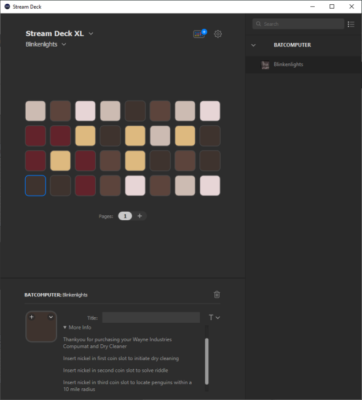

# streamdeck-blinkenlights

Make you streamdeck look look like the BATCOMPUTER from the only proper Batman series.

# Installation

To install, double-click Releases/com.randomnoun.blinken.streamDeckPlugin 

# TURBO BOOST

To increase the compumatic capabilities of the atomic-powered BATCOMPUTER depress the button in the top-left of the Streamdeck console. 

As always:

# ACHTUNG!
    
    ALLES TURISTEN UND NONTEKNISCHEN LOOKENSPEEPERS!
    DAS KOMPUTERMASCHINE IST NICHT FÜR DER GEFINGERPOKEN UND MITTENGRABEN! ODERWISE IST EASY TO SCHNAPPEN DER     
    SPRINGENWERK, BLOWENFUSEN UND POPPENCORKEN MIT SPITZENSPARKEN.
    IST NICHT FÜR GEWERKEN 

# Attribution

Based on the [streamdeck-numberdisplay](https://github.com/elgatosf/streamdeck-numberdisplay) sample ( MIT-licensed )
Uses the timer.js from [streamdeck-timerfix](https://github.com/elgatosf/streamdeck-timerfix) ( MIT-licensed )
